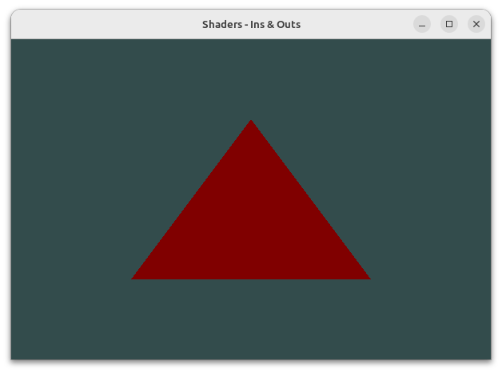
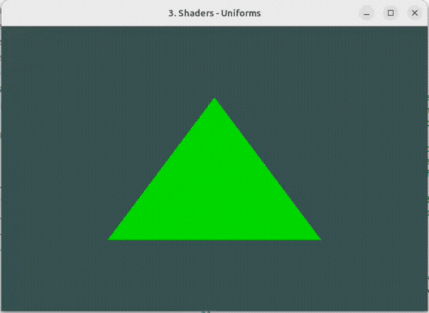
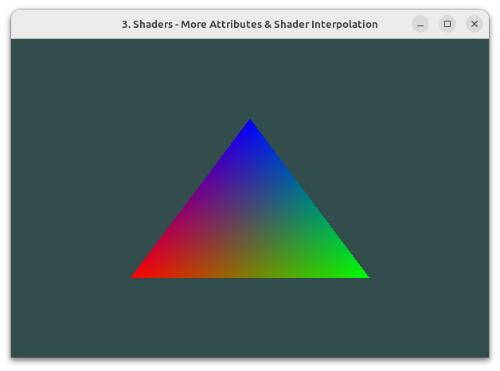

# learning-opengl

My journey of learning OpenGL from no graphics programming knowledge to building 2D &amp; 3D apps with C++.

I am primarily learning from [learnopengl.com](https://learnopengl.com/), and supplement it by watching [The Cherno's OpenGL series on YouTube](https://youtube.com/playlist?list=PLlrATfBNZ98foTJPJ_Ev03o2oq3-GGOS2&si=D4zxoX2-7yBqcKbB).
All these programs are written and executed on Ubuntu (Linux).

To execute any of the programs, first ensure that you have GLFW installed, then you can compile and execute the code with:

```bash
g++ file_name.cpp glad/src/glad.c -ldl -lglfw -o a.out; ./a.out
```

**Command breakdown:**

1. Compile code into an executable file:

    ```bash
    g++ file_name.cpp glad/src/glad.c -ldl -lglfw -o a.out
    ```

2. Run the executable file with:

    ```bash
    ./a.out
    ```

## Learning Journey

1. Chapter 1:
    - 1_hello_window.cpp

2. Chapter 2:
    - 2_hello_triangle.cpp
    - 2_hello_triangle_indexed.cpp

    Exercises:
    - **2_two_triangles_ex_1.cpp** - *Draws 2 triangles next to each other using glDrawArrays by adding more vertices to the vertex data*
    - **2_two_triangles_ex_2.cpp** - *Creates the same 2 triangles using two different VAOs and VBOs for their data*
    - **2_two_triangles_ex_3.cpp_** - *Creates two shader programs where the second program uses a different fragment shader that outputs the color yellow; draws both triangles again where one outputs the color yellow*

3. Chapter 3:
    - 3_shaders_1_ins_and_outs.cpp
    - 3_shaders_2_uniforms.cpp
    - 3_shaders_3_fragment_interpolation.cpp
    - 3_shaders_4_shader_class_fragment_interpolation.cpp
    - 3_Shader.h
    - 3_shader.vs
    - 3_shader.fs

    Exercises:
    - **3_shaders_ex_1.cpp** - *Adjust the vertex shader so that the triangle is upside down*
    - **3_shaders_ex_2.cpp** - *Specify a horizontal offset via a uniform and move the triangle to the right side of the screen in the vertex shader using this offset value*
    - **3_shaders_ex_3.cpp** - *Output the vertex position to the fragment shader using the out keyword and set the fragment's color equal to this vertex position (see how even the vertex position values are interpolated across the triangle). Once you managed to do this; try to answer the following question: why is the bottom-left side of our triangle black?*

## Screenshots






