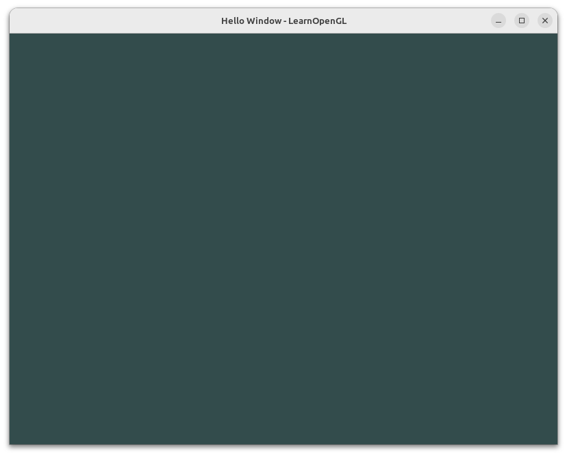
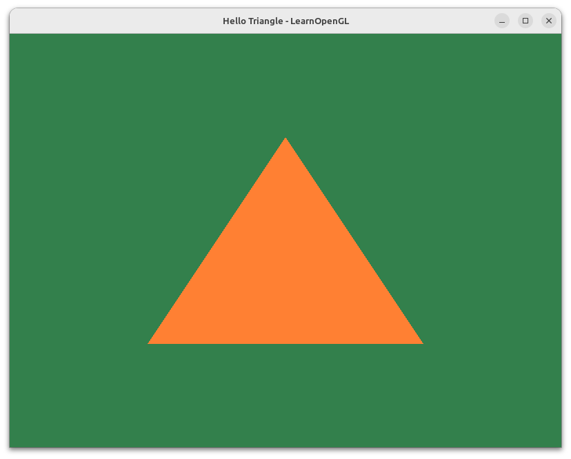
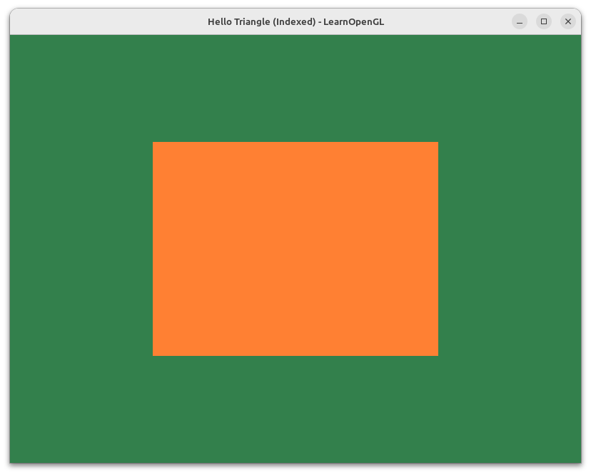
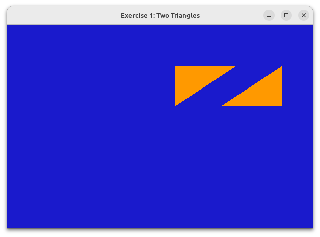
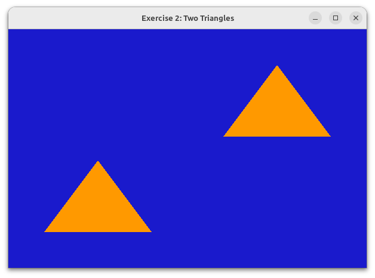
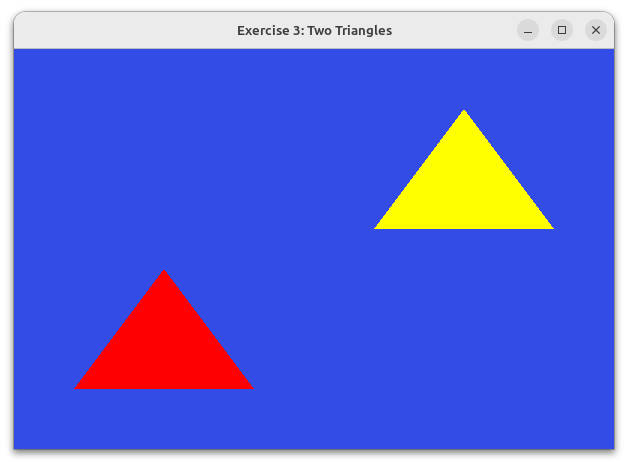
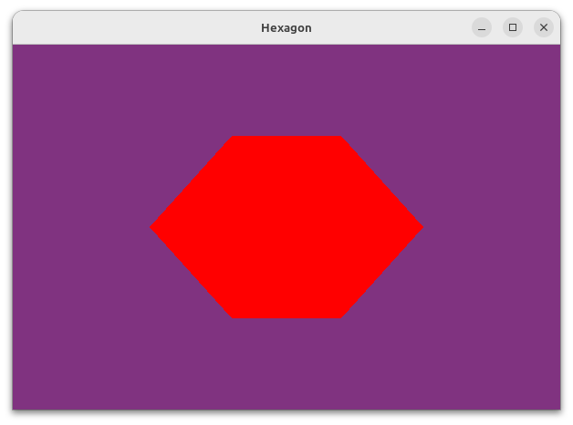

# learning-opengl

My journey of learning OpenGL from no graphics programming knowledge to building 2D &amp; 3D apps with C++.

I am primarily learning from [learnopengl.com](https://learnopengl.com/), and supplement it by watching [The Cherno's OpenGL series on YouTube](https://youtube.com/playlist?list=PLlrATfBNZ98foTJPJ_Ev03o2oq3-GGOS2&si=D4zxoX2-7yBqcKbB).
All these programs are written and executed on Ubuntu (Linux).

To execute any of the programs, first ensure that you have GLFW installed, then you can compile and execute the code with:

```bash
g++ file_name.cpp glad/src/glad.c -ldl -lglfw -o a.out; ./a.out
```

**Command breakdown:**

1. Compile code into an executable file:

    ```bash
    g++ file_name.cpp glad/src/glad.c -ldl -lglfw -o a.out
    ```

2. Run the executable file with:

    ```bash
    ./a.out
    ```

## Learning Journey

1. Chapter 1:
    - 1_hello_window.cpp

2. Chapter 2:
    - 2_hello_triangle.cpp
    - 2_hello_triangle_indexed.cpp

    Exercises:
    - **2_two_triangles_ex_1.cpp** - *Draws 2 triangles next to each other using glDrawArrays by adding more vertices to the vertex data*
    - **2_two_triangles_ex_2.cpp** - *Creates the same 2 triangles using two different VAOs and VBOs for their data*
    - **2_two_triangles_ex_3.cpp_** - *Creates two shader programs where the second program uses a different fragment shader that outputs the color yellow; draws both triangles again where one outputs the color yellow*

## Screenshots















